💙 Flutter Roadmap
---
Este Roadmap tem o intuito de auxiliar os estudos sobre o framework Flutter para desenvolvedores que desejam iniciar na área mobile com o Flutter, ou devs que já atuam na área (mas pretendem se especializar ou se atualizar). Assim, este Roadmap pode servir como um guia de tópicos que você pode estudar e se especializar. 

O Roadmap foi criado com base na experiência do autor, na documentação do Flutter e do Dart, bem como um alinhamento com a adoção / uso de tecnologias e packages pelas empresas. Portanto, este roadmap reflete também opiniões pessoais do autor. 

Caso você considere que está faltando algum tópico neste Roadmap, você pode contribuir com uma issue ou mesmo um PR.

📺 Vídeo: Roadmap Flutter 2024
---
Caso queira uma explicação de cada tópico, recomendo assistir ao vídeo abaixo no Youtube, onde explico cada área e o que ela compreende. Também aproveita, já se inscreva em nosso canal e também deixe o like no vídeo para apoiar o canal. 

💻 Como funciona
---
Encare este roadmap como uma trilha, uma jornada. Você pode achar que são muitos tópicos e ficar intimidado, mas esse não é o intuito! Entenda, a qualificação de um BOM desenvolvedor de software leva tempo, é uma maratona (e não um tiro de 100m). Por isso, use o roadmap para entender onde precisa melhorar, o que precisa estudar se já tem experiência em outra área, ou a sequência que precisa estudar caso esteja começando hoje. 

**🔵 Fundamental**: são conceitos e tópicos essenciais para trabalhar com o Flutter e conseguir evoluir na carreira. 

**🟢 Desejável**: é um segundo passo de estudo, onde o desenvolvedor irá se aprofundar em conceitos mais específicos do Flutter e Mobile. 

**🟡 Opcional**: são tópicos que você pode estudar para enriquecimento de conhecimento e também para especialização, após dominar os conceitos base. 

```mermaid
---
config:
    theme: 'base'
    flowchart:
        diagramPadding: 30
        nodeSpacing: 20
        curve: linear
        padding: 30
        arrowMarkerAbsolute: true
    themeVariables: 
        fontSize: 16
        fontFamily: 'Inter'
        primaryColor: '#000'
        primaryTextColor: '#fff'
        primaryBorderColor: '#30363E'
        lineColor: '#4F5A67'
        secondaryColor: '#0C1117'
---
flowchart LR
    flutter((Flutter)):::ball 
        flutter --> fund(🔵 Fundamentos da Computação):::topic
            fund --> fund1(🔵 Introdução à Computação):::leaf
            fund --> fund2(🔵 Lógica e Algoritmos):::leaf
            fund --> fund3(🔵 Estrutura de Dados):::leaf
            fund --> poo(Orientação a Objetos):::subtopic
                poo --> poo1(🟢 Princípios SOLID, KISS, DRY):::leaf
                poo --> poo2(🟢 Clean Code):::leaf
                poo --> dp(🟢 Design Patterns - Avançado):::subtopic
                    dp --> dp1(🟢 Singleton):::leaf
                    dp --> dp2(🟢 Repository):::leaf
                    dp --> dp3(🟢 Observer):::leaf
                    dp --> dp4(🟢 Adapter):::leaf
                    dp --> dp5(🟢 Factory):::leaf
                    dp --> dp6(🟢 Builder):::leaf
                    dp --> dp7(🟢 State):::leaf
                    dp --> dp8(🟢 Command):::leaf
                    dp --> dp9(🟢 Decorator):::leaf
                    dp --> dp10(🟢 Strategy):::leaf
                    dp --> dp11(🟡 Outros Patterns):::leaf
            fund --> fundoutros(Outros tópicos):::subtopic
                fundoutros --> fo1(🟢 Protocolos HTTP, WebSocket, WebRTC):::leaf
                fundoutros --> fo2(🟢 Padrões de UI):::subtopic
                    fo2 --> mvc(MVC):::leaf
                    fo2 --> mvvm(MVVM):::leaf
                    fo2 --> mvp(MVP):::leaf
                    fo2 --> mvi(MVI):::leaf
                fundoutros --> fo3(🟢 Arquitetura de Software):::leaf
                fundoutros --> fo4(🟢 Banco de Dados SQL e NoSQL):::leaf
                fundoutros --> fo5(🟡 UX, IHC e Testes de Interface):::leaf
                fundoutros --> fo6(🟡 Paradigmas de Programação):::leaf
                fundoutros --> fo7(🟡 Refatoração):::leaf
                fundoutros --> fo8(🟡 Gerenciamento de Projetos):::leaf
                fundoutros --> fo9(🟡 Segurança em Aplicações):::leaf
        
        flutter --> versao(Controle de Versão):::topic
            versao --> git(🔵 Git):::leaf
            versao --> github(🔵 Gitub):::leaf
            versao --> bitbucket(🟢 BitBucket):::leaf
            versao --> gitlab(🟢 Gitlab):::leaf

        flutter --> dart(Linguagem Dart):::topic
            dart --> dart1(🔵 Declaração de Variáveis):::leaf
            dart --> dart2(🔵 Null Safety):::leaf
            dart --> tipos(🔵 Tipos de Dados):::subtopic
                tipos --> tipos1(🟢 Generics):::leaf
                tipos --> tipos2(🟡 Records):::leaf
                tipos --> tipos3(🟡 Patterns):::leaf
                tipos --> tipos4(🟡 Typedef):::leaf
                tipos --> tipos5(🟡 Extension Types):::leaf
            dart --> dart3(🔵 Operadores):::leaf
            dart --> dart4(🔵 Controle de Fluxo):::leaf
            dart --> dart5(🔵 Funções):::leaf
            dart --> dart6(🔵 Orientação a Objetos):::leaf
            dart --> effective(🔵 Effective Dart):::subtopic
                effective --> ef1(🟢 Coding Style):::leaf
                effective --> ef2(🟡 Linter / Análise Estática):::leaf
            dart --> conc(Concorrência):::subtopic
                conc --> conc1(🟢 Event Loop):::leaf
                conc --> conc2(🔵 Future):::leaf
                conc --> conc3(🔵 Stream):::leaf
                conc --> conc4(🟡 Isolates ):::leaf
            dart --> avanc(Avançado):::subtopic
                avanc --> avanc1(🟡 Packages):::leaf
                avanc --> avanc2(🟡 Server / CLI):::leaf
                avanc --> avanc3(🟡 Interoperabilidade com FFI):::leaf

        flutter --> ide(IDE):::topic
            ide --> ide1(🔵 Android Studio):::subtopic
                ide1 --> ide11(Android SDKs):::leaf
                ide1 --> ide12(Build Tools):::leaf
                ide1 --> ide13(Emuladores):::leaf
                ide1 --> ide14(Outros):::leaf
            ide --> ide2(🔵 VSCode + Extensions):::leaf
            ide --> ide3(🔵 XCode - Mac e iOS):::leaf
            ide --> ide4(🔵 DartPad):::leaf
            ide --> ide5(🟢 Zapp.run):::leaf
            ide --> ide6(🟢 Google Project IDX):::leaf
            ide --> ide7(🟡 Zed):::leaf
            ide --> ide8(🟡 Intellij IDE):::leaf

        flutter --> sdk(Flutter):::topic
            sdk --> sdk1(🔵 Flutter CLI):::leaf
            sdk --> sdk2(🟢 FVM):::leaf
            sdk --> sdk3(🟢 Puro):::leaf

        flutter --> pm(Package Manager):::topic
            pm --> pub(🔵 pub.dev):::subtopic
                pub --> pub1(Como escolher um package?):::leaf
                pub --> pub2(Quem é o autor?):::leaf
                pub --> pub3(Suporte?):::leaf
                pub --> pub4(Plataformas?):::leaf
                pub --> pub5(Updates?):::leaf
                pub --> pub6(Documentação?):::leaf
                pub --> pub7(...):::leaf
            pm --> melos(🟡 Melos):::leaf

        flutter --> ui(User Interface):::topic
            ui --> widgets(Widgets):::subtopic
                widgets --> fw(Flutter Widgets):::subtopic
                    fw --> fw1(🔵 Stateless Widgets):::leaf
                    fw --> fw2(🔵 Stateful Widgets):::leaf
                    fw --> fw3(🟢 Inherited Widgets):::leaf
                widgets --> fui(UI):::subtopic
                    fui --> fui1(🔵 Styling):::leaf
                    fui --> fui2(🔵 Layout):::leaf
                    fui --> fui3(🔵 Interaction):::leaf
                    fui --> fui4(🔵 Assets):::leaf
                    fui --> fui5(Animações):::subtopic
                        fui5 --> fui51(🔵 Animações Implícitas):::leaf
                        fui5 --> fui52(🔵 Hero):::leaf
                        fui5 --> fui53(🟡 Animações Controladas):::leaf
                        fui5 --> fui54(🟡 Flutter Animate):::leaf
                        fui5 --> fui55(🟡 Rive):::leaf
                        fui5 --> fui56(🟡 Lottie):::leaf
                    fui --> fui6(🟢 Tema e Design System):::subtopic
                        fui6 --> fui61(ThemeData):::leaf
                        fui6 --> fui62(FlexColorScheme):::leaf
                        fui6 --> fui63(Mix):::leaf
                widgets --> md(🔵 Material Widgets):::leaf
                widgets --> cu(🟢 Cupertino Widgets):::leaf
            ui --> nav(Navegação):::subtopic
                nav --> nav1(🔵 Navigator):::leaf
                nav --> nav2(🔵 Tabs e Bottom Navigation):::leaf
                nav --> nav3(🔵 Rotas Nomeadas):::leaf
                nav --> nav4(🔵 Go Router):::leaf
                nav --> nav5(🟢 Deep Linking):::leaf
                nav --> nav6(🟡 Routefly):::leaf
                nav --> nav7(🟡 Beamer):::leaf
                nav --> nav8(🟡 RouteMaster):::leaf
                nav --> nav9(🟡 AutoRoute):::leaf
            ui --> sm(State Management):::subtopic
                sm --> sm1(Nativa):::subtopic
                    sm1 --> sm1a(🔵 setState):::leaf
                    sm1 --> sm1b(🔵 ValueNotifier):::leaf
                    sm1 --> sm1c(🔵 ChangeNotifier):::leaf
                    sm1 --> sm1d(🔵 Inherited Widgets - Model e Notifier):::leaf
                    sm1 --> sm1e(🔵 ListenableBuilder):::leaf
                sm --> sm2(🔵 Provider):::leaf
                sm --> sm3(🔵 BLoC):::leaf
                sm --> sm4(🔵 GetIt):::leaf
                sm --> sm5(🟢 Riverpod):::leaf
                sm --> sm6(🟢 MobX):::leaf
                sm --> sm7(🟢 ASP):::leaf
                sm --> sm8(🟢 Triple):::leaf
                sm --> sm9(🟡 Signals):::leaf
                sm --> sm10(🟡 SolidDart):::leaf
                sm --> sm11(🟡 AutoInjector):::leaf

        flutter --> net(Networking):::topic
            net --> http(HTTP):::subtopic
                http --> http1(🔵 http):::leaf
                http --> http2(🔵 dio):::leaf
                http --> http3(🟢 celest):::leaf
                http --> http4(🟢 uno):::leaf
            net --> grpc(🟡 gRPC):::leaf
            net --> gql(🟡 GraphQL):::leaf

        flutter --> dados(Dados):::topic
            dados --> local(Persistência Local):::subtopic
                local --> sqlite(🔵 SQLite):::leaf
                local --> sp(🔵 SharedPreferences):::leaf
                local --> ssp(🔵 Secure SharedPreferences):::leaf
                local --> hive(🟢 Hive):::leaf
                local --> isar(🟢 Isar):::leaf
                local --> ob(🟡 ObjectBox):::leaf
                local --> realm(🟡 Realm):::leaf
            dados --> remote(Persistência Remota):::subtopic
                remote --> api(🔵 Backend / API própria):::leaf
                remote --> fire(🔵 Firebase):::leaf
                remote --> supa(🟡 Supabase):::leaf
                remote --> pocket(🟡 Pocketbase):::leaf
            dados --> format(Formatos):::subtopic
                format --> format1(🔵 JSON):::leaf
                format --> format2(🔵 Media geral):::leaf
                format --> format3(🟡 ProtoBuf):::leaf

        flutter --> native(Recursos Nativos):::topic
            native --> native1(🟢 Câmera):::leaf
            native --> native2(🟢 QRCode):::leaf
            native --> native3(🟢 Geolocation):::leaf
            native --> native4(🟢 Maps):::leaf
            native --> native5(🟢 Sharing):::leaf
            native --> native6(🟢 Device Info):::leaf
            native --> native7(🟢 Notifications):::leaf
            native --> native8(🟡 Platform Channels):::leaf

        flutter --> testes(Testes):::topic
            testes --> unidade(🔵 Unidade):::leaf
            testes --> wid(🔵 Widgets):::leaf
            testes --> golden(🟢 Golden Tests):::leaf
            testes --> integracao(🔵 Integração):::leaf
            testes --> tdd(🟢 TDD):::leaf
            testes --> e2e(🟢 E2E):::leaf
            testes --> tools(Ferramentas):::subtopic
                tools --> patrol(🔵 Patrol):::leaf
                tools --> flutti(🟢 Fluttium):::leaf
                tools --> testlab(🟢 Firebase Test Lab):::leaf
                tools --> appium(🟢 Appium):::leaf
                tools --> aws(🟡 AWS Device Farm):::leaf

        flutter --> outros(Outros):::topic
            outros --> outros1(🔵 Flutter DevTools):::leaf
            outros --> outros2(🔵 App LifeCycle):::leaf
            outros --> outros3(🟡 Árvores do Flutter):::leaf
            outros --> outros4(🟡 CustomPaint):::leaf
            outros --> outros5(🟡 RenderObjects):::leaf
            outros --> outros6(🟡 Platform Channels):::leaf

        flutter --> ci(CI/CD):::topic
            ci --> fast(🔵 Fastlane):::leaf
            ci --> gitac(🔵 Github Actions):::leaf
            ci --> codemagic(🟢 Code Magic):::leaf
            ci --> firebaseapp(🟢 Firebase App Distribution):::leaf
            ci --> bitrise(🟡 Bitrise):::leaf

        flutter --> publi(Publicação):::topic
            publi --> guide(🔵 Guidelines e Políticas):::leaf
            publi --> apple(🔵 Apple Store):::leaf
            publi --> play(🔵 Play Store):::leaf
            publi --> outras(🟡 Outras Lojas):::leaf

        flutter --> analytics(Analytics):::topic
            analytics --> firean(🔵 Firebase Google Analytics):::leaf
            analytics --> mixp(🟡 MixPanel):::leaf
            analytics --> amp(🟡 Amplitude):::leaf
            analytics --> seg(🟡 Segment):::leaf

        flutter --> obs(Monitoramento):::topic
            obs --> crash(🔵 Firebase Crashlytics):::leaf
            obs --> sentry(🔵 Sentry):::leaf
            obs --> bug(🟡 Bugsnag):::leaf
            obs --> isnta(🟡 Instabug):::leaf

        flutter --> serv(Serviços):::topic
            serv --> shorebid(🟡 Shorebird):::leaf
            serv --> fir(🟢 Firebase):::subtopic
                fir --> fir1(🔵 Push Notifications):::leaf
                fir --> fir2(🔵 Remote Config - Feature Flags):::leaf
                fir --> fir3(🟢 Authentication):::leaf
                fir --> fir4(🟡 Storage):::leaf
                fir --> fir5(🟡 Cloud Functions):::leaf
                fir --> fir6(🟡 IA):::leaf
            serv --> pag(Pagamentos):::subtopic
                pag --> pag1(InApp Purchase):::leaf
                pag --> pag2(RevenueCat):::leaf
                pag --> pag3(Stripe):::leaf
                pag --> pag4(Qonvertion):::leaf
                pag --> pag5(Padseguro):::leaf
                pag --> pag6(Pagar.me):::leaf
            serv --> metricas(Métricas):::subtopic
                metricas --> codem(🟢 Code Metrics):::leaf
                metricas --> sonar(🟢 SonarQube):::leaf

    
    
    classDef ball fill:#0071BD,stroke:#30363E,stroke-width:3px,color:#FFF
    classDef topic fill:#000,stroke:#30363E,stroke-width:2px,color:#FFF
    classDef subtopic fill:#0C1117,stroke:#30363E,stroke-width:1px,color:#FFF
    classDef leaf fill:#0C1117,stroke:#30363E,stroke-width:0px,color:#FFF
```

